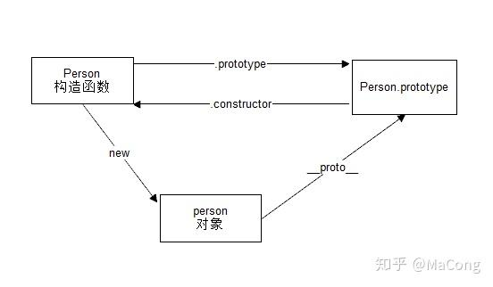
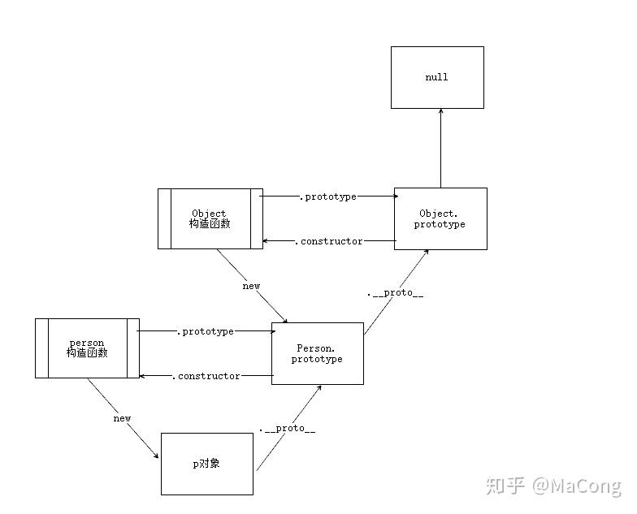

# 原型与原型链

## 原型

原型是函数独有的属性 prototype(原型) ，这个属性是一个指针，指向一个对象，而这个对象的用途是可以由特定类型所有实例共享的属性和方法



图解：

- 每一个构造函数都拥有一个 `prototype` 属性，这个属性指向一个对象，也就是原型对象
- 原型对象默认拥有一个 `constructor` 属性，指向指向它的那个构造函数
- 每个对象都拥有一个隐藏的属性 `__proto__`，指向它的原型对象

## 原型链

 `JavaScript` 中所有的对象都是由它的原型对象继承而来。而原型对象自身也是一个对象，它也有自己的原型对象，这样层层上溯，就形成了一个类似链表的结构，这就是原型链 



## 原型链的问题

原型链可以共享方法和属性，方便了很多操作，但是同时也有问题存在

```javascript
function Person(){}
Person.prototype.arr = [1, 2, 3, 4];

var person1 = new Person();
var person2 = new Person();

person1.arr.push(5) 
person2.arr // [1, 2, 3, 4, 5]
```

 引用类型，变量保存的就是一个内存中的一个指针。所以，当原型上面的属性是一个引用类型的值时，通过其中某一个实例对原型属性的更改，结果会反映在所有实例上面，这也是原型 `共享` 属性造成的最大问题 

 另一个问题就是在创建子类型（比如上面的 `person`）时，没有办法向超类型（ `Person` ）的构造函数中传递参数 